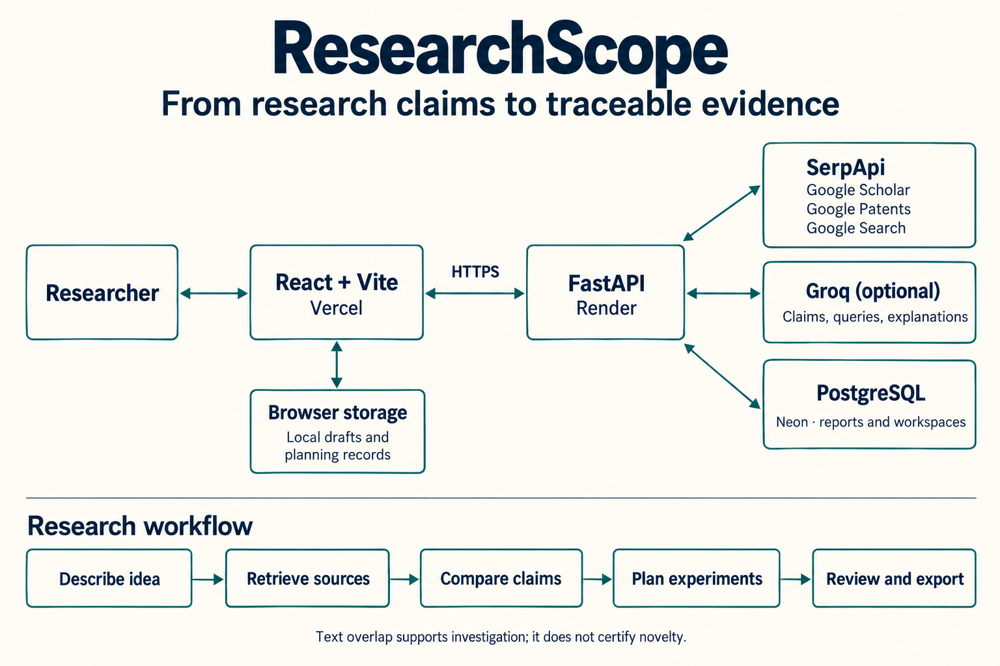

<div align="center">

# ResearchScope

### Check the prior work. Sharpen the claim. Plan the next experiment.

A research workspace for comparing an idea with papers, patents, and public implementations — and keeping the evidence behind each decision.

[](https://serpapi.com/)


[](LICENSE)

**[Open ResearchScope](https://researchscope-omega.vercel.app/research-scope)** · **[Explore the sample](https://researchscope-omega.vercel.app/research-scope/reports/sample)** · **[Project overview](https://researchscope-omega.vercel.app/research-scope/about)**

Built for the **SerpApi India Hackathon 2026** · Knowledge & Public Interest

<!-- VIDEO: Once the public or unlisted video is ready, add its URL here:
[Watch the demo — under 3 minutes](PASTE_VIDEO_URL_HERE)
-->

</div>

---

## The question behind the project

“Has someone already done this?” is rarely answered by a single search. A method may appear in one paper, the application in a patent, and an implementation somewhere on the web. Even after finding those sources, a researcher still has to decide what overlaps and what experiment would establish a useful contribution.

ResearchScope brings that work into one place. Start with an abstract and a few claims, inspect the closest retrieved evidence, narrow the contribution, and record what needs to happen next.

> A low overlap score is a reason to investigate further, not proof of novelty. ResearchScope does not certify scientific novelty or determine patentability.

## See it in action

<!-- SCREENSHOT 1 — MAIN PRODUCT IMAGE
Save your real screenshot as assets/readme/report-overview.png.
Capture a completed LIVE ResearchScope report with the title, Overview, and section navigation visible.
Hide API keys, browser account details, and owner/reviewer tokens in the address bar.
Then uncomment the image below by moving it outside this comment:

-->

**Start with the [prepared sample](https://researchscope-omega.vercel.app/research-scope/reports/sample)** to explore the interface without credentials or search credits. Its evidence is explicitly fictional. For real results, open **New research** and submit a live search.

### A quick route through the demo

1. **Describe the idea.** Enter a title, abstract, keywords, and up to three claims. The included crop-disease example is a useful starting point.
2. **Run a live search.** Review the provider consent and click **Search papers and patents**.
3. **Read the evidence.** Open a source, inspect its excerpt, record a screening decision, and add it to the reading queue.
4. **Make the claim testable.** Use **Find a tool** to open **Claim-to-measurement alignment**. Specify a baseline, metric, and success threshold.
5. **Keep the work.** Open **Record → Export complete project** to download the report and saved research assessments.

The report has six sections: **Overview → Evidence → Claims → Study → Review → Record**. The tool finder opens individual checks without scrolling through every tool.

<!-- SCREENSHOT 2 — EVIDENCE REVIEW
Save as assets/readme/evidence-review.png.
Capture a real source detail with its excerpt, screening decision, and reading-queue control.


SCREENSHOT 3 — EXPERIMENT PLAN
Save as assets/readme/experiment-plan.png.
Capture Claim-to-measurement alignment with an example baseline, metric, and proposed threshold.
Do not present planned targets as measured results.

-->

## What you can do

| Research task | In ResearchScope |
| --- | --- |
| Find nearby work | Search scholarly publications, patents, and public implementations together. Keep source links and the queries used. |
| Inspect a match | Read excerpts, compare claims, screen sources, and maintain a reading queue. |
| Refine the contribution | Review combination overlap, cautious novelty wording, claim boundaries, and contribution importance. |
| Plan a credible study | Record baseline fairness, candidate confounders, measurements, acceptance criteria, and a minimum study plan. |
| Review the evidence | Track publication families, evidence snapshots, citation-support assessments, and unresolved questions. |
| Work with a reviewer | Use separate owner and reviewer links for saved unlisted research workspaces; collect feedback and explicitly publish shared planning records. |
| Preserve the decision | Record proceed/revise/pause reasoning and export the report, references, and local assessments. |
| Work with local notes | Compare an idea with text on your device in the separate private local workspace, without running a web search. |

Many checks are structured records for the researcher to complete and review. A filled checklist is not an independently verified finding.

## Where SerpApi fits

SerpApi supplies the live discovery layer. The backend builds queries from the proposal and collects results from:

| Engine | What it contributes |
| --- | --- |
| Google Scholar | Related papers and available publication/citation metadata. |
| Google Patents | Patent results and selected patent details. |
| Google Search | Public implementations, project pages, and other web evidence. |

Returned records are normalized and compared with the submitted claims. The report retains source provenance, exact queries, and provider warnings. Optional Groq processing helps structure claims and queries and explain retrieved evidence after consent.

The comparison combines text similarity, claim coverage, and phrase overlap. Added sources and researcher notes remain separate from the original saved scores. Missing full text, sparse results, and incomplete coverage remain visible limitations.

### Search credits

- A research novelty run has a ceiling of **8 SerpApi attempts**, including retries; actual usage depends on the search.
- The configured shared allowance is **20 attempts per day**, resetting at midnight UTC. It is shared across the application's search routes.
- Hosted research reports also have a separate per-IP creation limit, configured through `HOSTED_REPORTS_PER_IP_PER_DAY` (default: 2).
- The shared allowance may run out first. When hosted allowance cannot fund a search, the interface offers a personal SerpApi key and an optional Groq key.
- Personal keys remain in page memory, are sent to the backend for the selected provider requests, and are excluded from saved reports and exports. Reloading clears them. Personal provider charges apply to that user's account.
- Groq has its own hosted daily budget; the SerpApi limit does not cover Groq usage.

## Architecture



The browser sends research requests to the FastAPI backend. The backend manages provider calls, budgets, comparisons, and report persistence. Local drafts and planning records stay in browser storage until explicitly exported or shared.

| Layer | Stack |
| --- | --- |
| Interface | React 19, TypeScript, Vite, TanStack Query |
| API and analysis | Python, FastAPI, Pydantic |
| Persistence | SQLAlchemy, Alembic, PostgreSQL; SQLite for local development |
| Discovery | SerpApi |
| Optional language processing | Groq |
| Hosting | Vercel frontend, Render backend, Neon database |
| Checks | Vitest, Testing Library, pytest, GitHub Actions |

## Run it locally

Use **Python 3.12** and **Node.js 22**. Run the following from a PowerShell terminal:

```powershell
git clone https://github.com/BasilZafar11/ResearchScope.git
cd ResearchScope
python -m venv .venv
.\.venv\Scripts\python.exe -m pip install -r backend/requirements-lock.txt
Copy-Item backend/.env.example backend/.env
cd backend
..\.venv\Scripts\python.exe -m alembic upgrade head
..\.venv\Scripts\python.exe -m uvicorn app.main:app --host 127.0.0.1 --port 8000 --no-access-log
```

In a second terminal, from the repository root:

```powershell
cd frontend
npm ci
npm run dev
```

Open **http://127.0.0.1:5173/research-scope**. The prepared sample is at **http://127.0.0.1:5173/research-scope/reports/sample** and requires no provider key.

On macOS or Linux, use `python3 -m venv .venv`, `cp` instead of `Copy-Item`, and `.venv/bin/python` instead of `.venv\Scripts\python.exe` (or `../.venv/bin/python` from `backend`).

The repository also contains a companion market-research workspace at `/` and `/market`. Use `/research-scope` for this project's research demo.

### Enable live research

Edit `backend/.env` before starting the backend:

```dotenv
LIVE_SERPAPI_ENABLED=true
SERPAPI_KEY=your_serpapi_key
IP_HASH_SECRET=replace_with_a_random_secret_at_least_32_characters_long
HOSTED_SERPAPI_DAILY_BUDGET=20
HOSTED_SERPAPI_RESERVE=0
```

Use a genuinely random value for `IP_HASH_SECRET`; keep it stable across deployments. The default SQLite database is sufficient for local development. For PostgreSQL, set `DATABASE_URL` to your connection string with the appropriate driver and SSL settings.

Optional Groq configuration:

```dotenv
GROQ_ENABLED=true
GROQ_API_KEY=your_groq_key
GROQ_MODEL=openai/gpt-oss-20b
HOSTED_GROQ_DAILY_BUDGET=20
```

Keep provider credentials in the backend environment or use the app's personal-key dialog. Never place secrets in `VITE_*` variables: those values are included in the browser build.

<details>
<summary><strong>Deployment settings</strong></summary>

**Vercel:** set the root directory to `frontend`, use the Vite preset, build with `npm run build`, and publish `dist`. Set:

```dotenv
VITE_API_URL=https://researchscope-8oyv.onrender.com
```

**Render:** deploy the Docker service from `backend`. Configure `DATABASE_URL`, provider credentials, the budget values, and a stable `IP_HASH_SECRET`. Set:

```dotenv
CORS_ORIGINS=["https://researchscope-omega.vercel.app"]
```

The Docker startup command runs `alembic upgrade head` before starting the API. The process runs as a non-root user. `/health` checks the API's database connection.

Update the URLs for your own deployment. Environment changes on manually configured hosting services must be applied in their dashboards; editing `render.yaml` alone does not update those services.

</details>

## Data and access

- **Saved reports:** expire after 12 days. Unsaved report links expire after one hour.
- **Unlisted reports:** anyone holding the report link can read the idea and evidence. Unlisted does not mean private.
- **Public reports:** may be listed publicly. Publishing is an explicit choice.
- **Research workspaces:** owner credentials are issued when the workspace is created with the report. Ordinary report links cannot claim ownership. Owners can replace workspace links.
- **Local records:** browser drafts and planning records have separate storage lifetimes. Export before clearing storage or changing devices.
- **Private local workspace:** compares supplied text in the browser without external research requests. It does not search the literature.
- **PDF review:** accepts PDFs up to 5 MB and uses a resource-limited Linux worker. Scanned pages and figures may need manual review; the isolated extraction service is unavailable on non-Linux hosts.

## Development checks

From the repository root, in PowerShell:

```powershell
cd backend
..\.venv\Scripts\python.exe -m pytest -q
cd ../frontend
npm test
npm run build
```

GitHub Actions runs the backend tests, migration check, secret scan, frontend tests, and production build. Provider tests use fakes rather than paid searches. Passing tests does not establish complete coverage of production concurrency or external-provider behavior.

## Project layout

```text
backend/
  app/                 API, provider clients, analysis, and access controls
  alembic/             Database migrations
  tests/               Backend regression tests
frontend/
  src/pages/           Research and market routes
  src/components/      Reports, evidence review, and planning tools
  src/api/             API clients and personal-key handling
  src/lib/             Record validation, drafts, and tool registry
assets/readme/         Architecture image and future screenshots
scripts/               Repository checks
render.yaml            Deployment blueprint
```

## Current boundaries

Search coverage depends on the queries and provider results. Retrieved excerpts can miss important details in the full publication. Claims, suggested gaps, experiment plans, and reviewer identities still need human review. Publication watching operates while the report is open; it is not a background email-alert service.

## License

[MIT](LICENSE).
